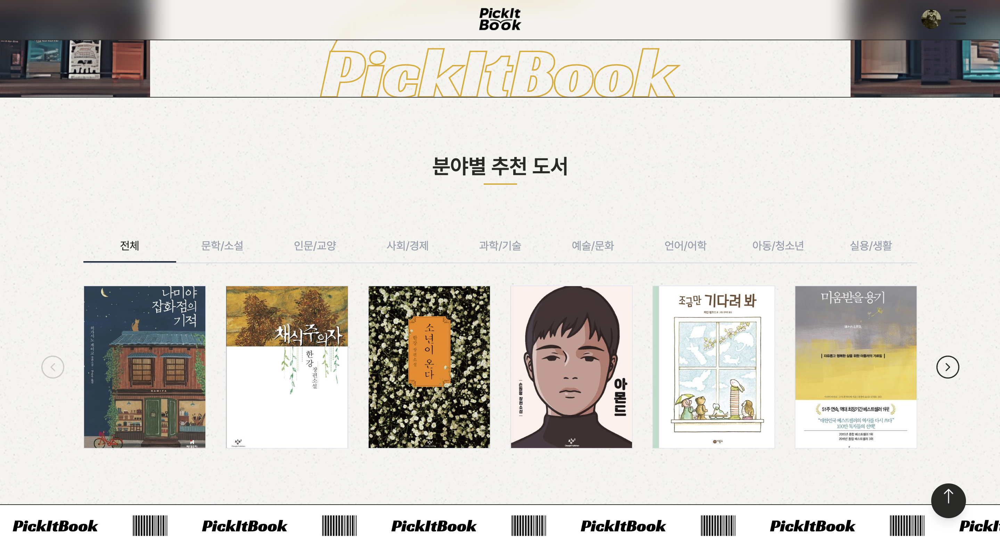

# 📚 PickItBook  

오늘 읽을 책을 ‘룰렛’으로 랜덤하게 뽑고, 독서 챌린지까지 제시함으로써 선택장애를 해소하고 재미 요소를 더한 책 추천 서비스  

---

## 🚀 배포 & 레포지토리
👉 [서비스 바로가기](https://fes-5-project-team-6.vercel.app)  
👉 [GitHub Repository](https://github.com/prgrms-fe-devcourse/FES-5-Project-TEAM-6)


---

## 📌 프로젝트 개요  
- **프로젝트명**: PickItBook  
- **기간**: 2025.08.22 ~ 2025.09.07  
- **목표**:  
  - 책 선택의 어려움 해결  
  - 독서 습관 형성을 위한 게임화 요소 도입  
  - 다양한 장르와 미션을 통한 새로운 독서 경험 제공  

- **와이어프레임**  
  <details>
    <summary>펼쳐보기</summary>
    <p align="center">
      
    </p>
  </details>

---

## 🖥 주요 기능  
1. **랜덤 룰렛 추천**  
   - 장르/인기작/연령/성별 필터 적용  
   - 룰렛 애니메이션을 통해 책과 독서 미션 랜덤 추첨  

2. **독서 미션 시스템**  
   - 난이도별 랜덤 미션 제시 (초급/중급/고급)  
   - 미션 완료 시 뱃지/보상 획득  

3. **개인 서재**  
   - 읽은 책 기록 및 관리  
   - 독서 통계와 성취 대시보드 제공  

4. **도서 검색 & 리뷰**  
   - 제목·작가·장르 검색  
   - 리뷰, 별점, 인상 깊은 구절 등록 가능  

---

## 📂 폴더 구조  

```bash
FES-5-Project-TEAM-6
├── public/              # 정적 파일 (아이콘, 이미지, 배너 등)
├── src/
│   ├── api/             # API 요청 관련 코드
│   ├── assets/          # 폰트, 공통 리소스
│   ├── components/      # 재사용 UI 컴포넌트
│   ├── hook/            # 커스텀 훅
│   ├── Page/            # 주요 페이지 단위
│   │   ├── Auth/        # 로그인/회원가입
│   │   ├── BookDetail/  # 도서 상세 페이지
│   │   ├── Library/     # 내 서재
│   │   ├── Main/        # 메인 페이지
│   │   ├── MyPage/      # 마이페이지
│   │   ├── Roulette/    # 랜덤 책 룰렛
│   │   ├── Search/      # 도서 검색
│   │   └── NotFound/    # 404 페이지
│   ├── router/          # 라우팅 설정
│   ├── store/           # 상태 관리 (Zustand)
│   ├── style/           # 공통 스타일, 테마 CSS
│   ├── utils/           # 유틸 함수
│   ├── App.tsx          # 메인 엔트리
│   └── main.tsx         # Vite 진입점
├── .env                 # 환경 변수
├── package.json
└── README.md

```

---

## 💡 문제 정의 & 차별점  
- **문제**  
  - 선택장애로 책을 고르지 못함  
  - 같은 장르 반복 소비  
  - 중도 포기, 성취감 부족  

- **차별점**  
  - 단순 추천이 아닌 **룰렛 + 챌린지**로 게임화  
  - **랜덤 미션**을 통해 독서 실행 확률 증가  
  - **데이터 시각화**로 독서 패턴 및 성취 확인 가능  

---

## 📊 서비스 화면 (예시)  




---

## 🧩 시스템 아키텍처  

- **클라이언트/배포**: Vercel (정적 + 서버리스)  
- **프록시 계층**: AWS EC2 (Nginx → Node Proxy)  
  - 외부 OpenAPI(도서관 정보나루 등) 화이트리스트 IP 대응  
  - AuthKey 보호, 타임아웃/리트라이 제어  
- **데이터**: Supabase (PostgreSQL / Auth / Storage)  
- **라우팅**: `/api/*` 요청은 Vercel → EC2 프록시 → 외부 API  
- **헬스체크**: `/healthz` (EC2)

```mermaid
flowchart LR
  A[Browser] -->|/api/*| B[Vercel (SPA + Rewrites)]
  A <-->|HTML/CSS/JS| B
  B -->|rewrite/proxy| C[EC2 (Nginx → Node Proxy)]
  C --> D[data4library OpenAPI]
  C --> E[Supabase<br/>DB · Auth · Storage]

  ```
---

## ⚙️ 기술 스택  
- **Frontend**: React, Vite, TypeScript, TailwindCSS, GSAP, Three.js, React-Router  
- **Backend/DB**: Supabase (PostgreSQL, Auth, Storage)  
- **API**: 도서관 정보나루 API  
- **Deployment**: Vercel, AWS

---

## 👥 팀원 소개  
- **팀장**: 윤대웅
- **팀원**: 현은정  
- **팀원**: 황유정 
- **팀원**: 박진강

ajx

---

## 🚀 향후 발전 방향  
- AI 기반 독서 요약 및 개인 맞춤형 추천  
- 도서관 소장 여부 + 근처 도서관 대출 정보 자동 연동  
- 커뮤니티 기능 강화 (사용자간 공유/피드백)  
- 모바일 UX 최적화  

---
